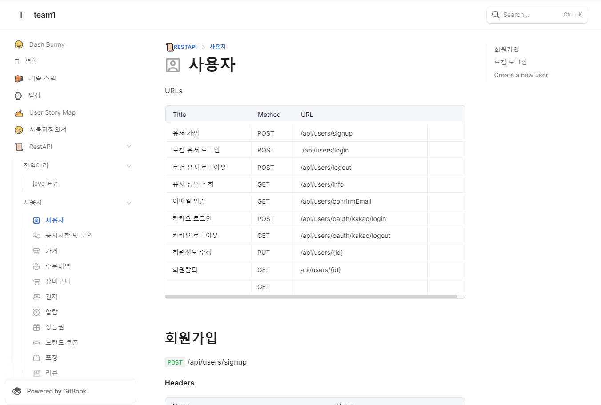
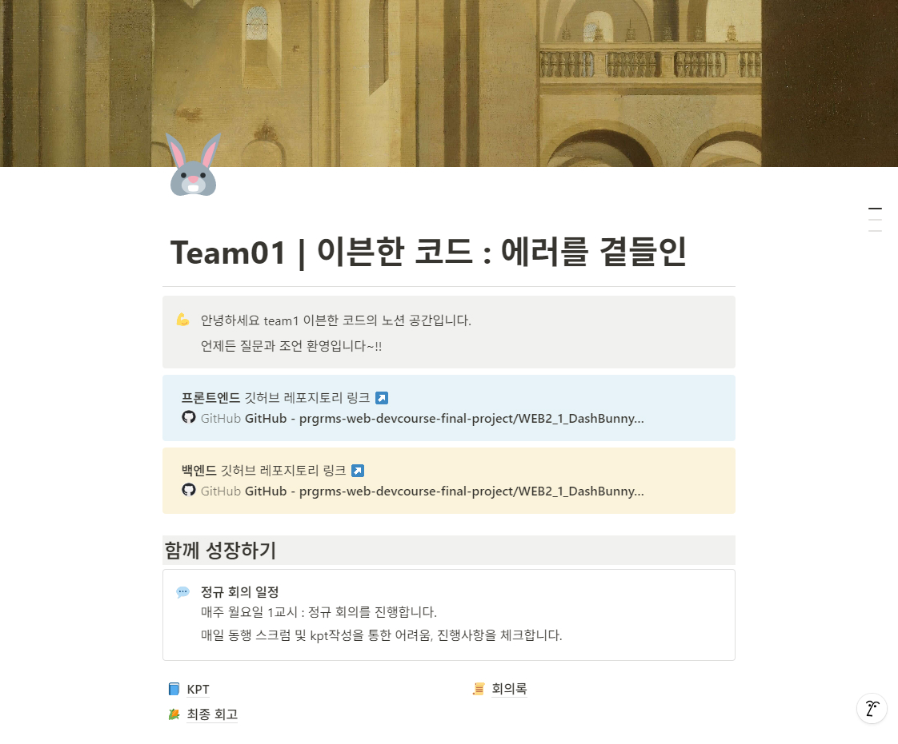

## 팀원 소개

| 팀장 | 팀원 | 팀원 | 
|:---:|:---:|:---:|
[한승철](https://github.com/HSCHEOL)| [최수진](https://github.com/tomatto0) | [김용환](https://github.com/yonghwna)  | 
|||

## 🗓️ 작업기간 

2024/11/15 ~ 2024/12/9

## 📔 기획문서

전체 프로젝트 기획서(Gitbook)

[🔗 GitBook 바로가기](https://team1-4.gitbook.io/team1)

프로젝트 노션

[🔗 Notion 바로가기](https://neul.notion.site/Team01-159dc69321d780c98a89d9b62f3a597f?pvs=4)

유저 스토리

유저스토리는 소비자와 관리자/사장님 두 그룹으로 나누어 작성하였습니다. 각 플랫폼의 유저 니즈와 핵심 기능을 연계하여, 구현해야 할 기능의 우선순위를 체계적으로 고려하였습니다.

  

요구사항 명세서

[🔗 요구사항 명세서 바로가기](https://docs.google.com/spreadsheets/d/1SIp4nXwJ0ElFOywPJW0efp9M_8tOnuo6Mcc7AePjCrI/edit?usp=sharing/)

FIGMA

[🔗 FIGMA 바로가기](<https://www.figma.com/design/2tK4q9q0Tj8ekFfGMZC77K/FE2-4%EC%B0%A8-%ED%94%84%EB%A1%9C%EC%A0%9D%ED%8A%B8-%ED%99%94%EB%A9%B4%EA%B8%B0%ED%9A%8D%EC%84%9C_1118(%EC%99%B8%EB%B6%80%EB%85%B8%EC%B6%9C%EC%9A%A9)?node-id=1-3&t=EaPrvldFNMvwYRRS-1>)

?node-id=1-3&t=EaPrvldFNMvwYRRS-1>)

## 역할
| 담당도메인 | 담당자 | 레포지토리 링크 |
| --- | --- | --- |
| **소비자** | 김용환 | [DashBunny 소비자 도메인 FE Repo](https://github.com/yonghwna/WEB2_1_DashBunny_FE) |
| **사장님** | 최수진 | [DashBunny 사장님 도메인 FE Repo](https://github.com/neulrain/WEB2_1_DashBunny_FE) |
| **관리자** | 한승철 | [DashBunny 관리자 도메인 FE Repo](https://github.com/HSCHEOL/DashBunny_FE) |
## skills

