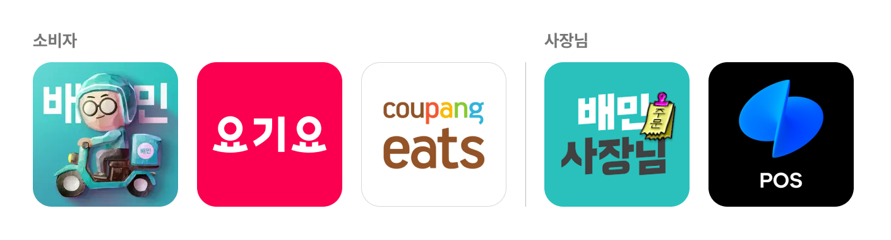
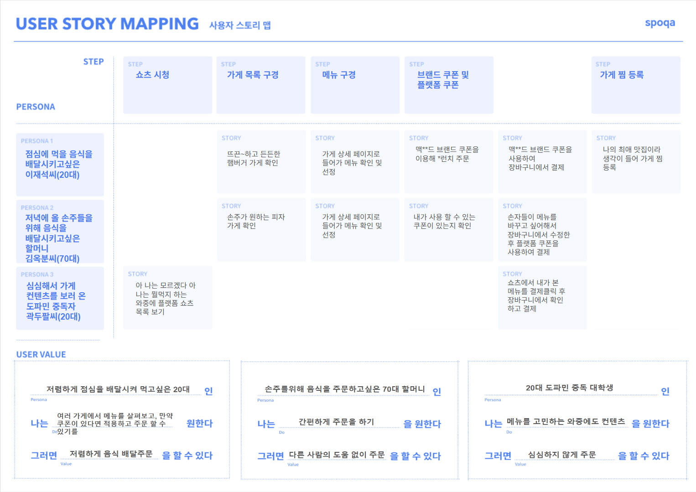
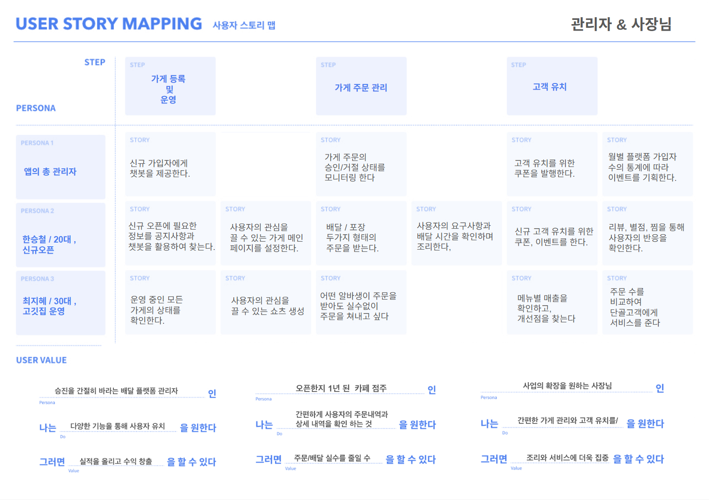
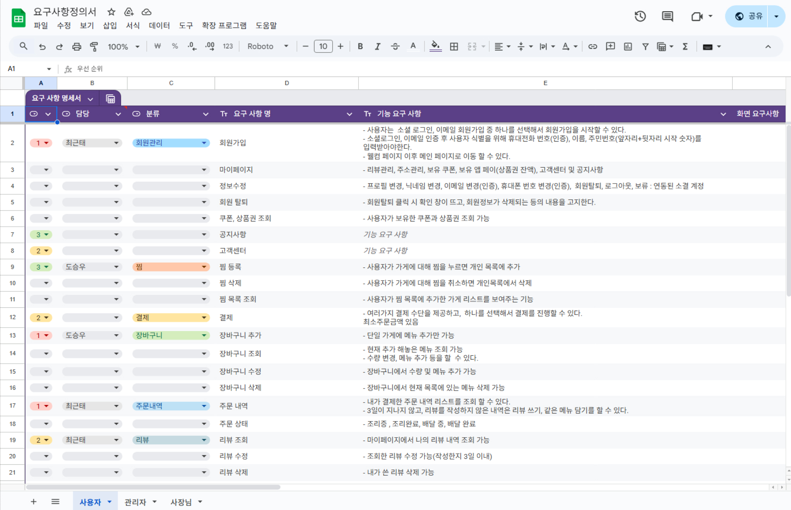
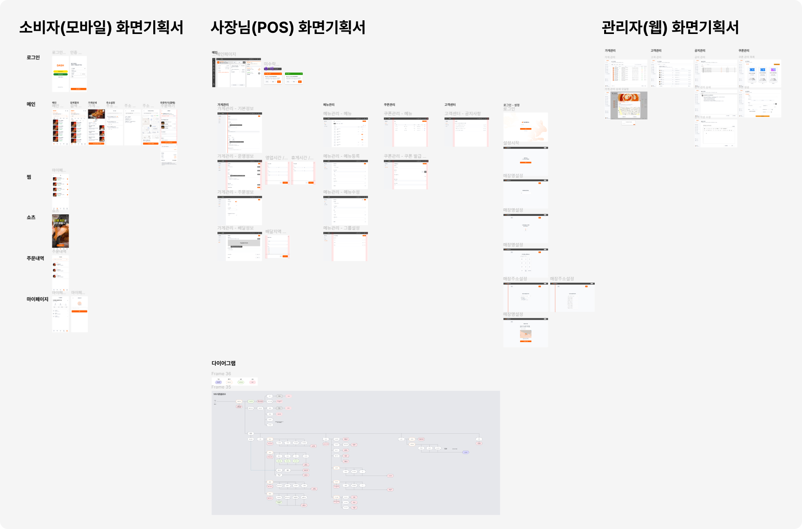
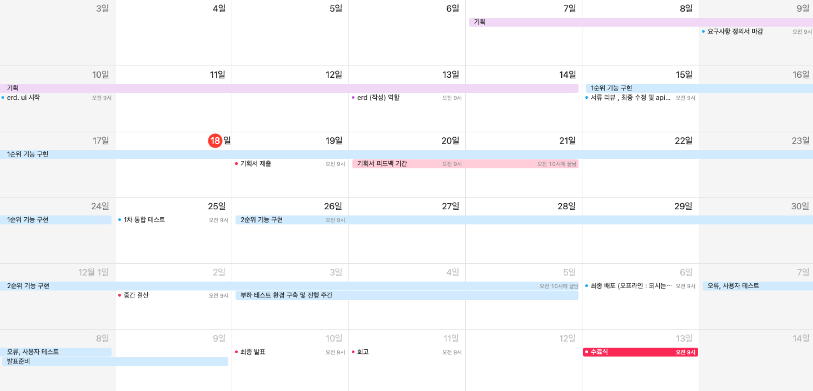
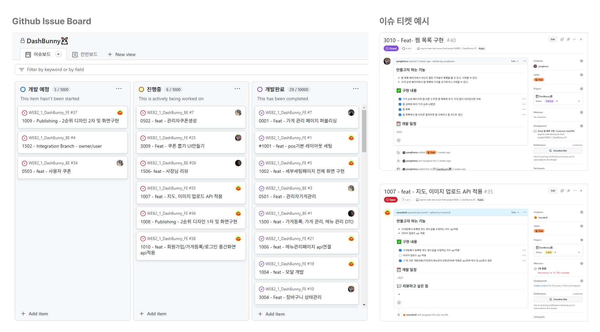

## 📌서비스 소개 및 기획의도

### 개요

**Dash Bunny**는 친근한 배달원 캐릭터 토끼를 활용해 빠르고 효율적인 딜리버리 서비스를 제공하는 프로젝트입니다.기존 배달 앱의 한계점인 메뉴 큐레이션을 **쇼츠(Shorts)콘텐츠**를 통해 제공하여 사용자 경험을 증진하는 것을 목표로 하는 배달 플랫폼 입니다.

### 🔍벤치마킹

본 프로젝트 시스템은 배달의 민족 플랫폼을 벤치마킹하여 설계되었습니다. 다양한 배달 플랫폼의 장점들을 분석하고 통합하여, 사용자 중심의 UX/UI를 구현하는 데 초점을 맞추었습니다. 이를 통해 직관적이고 편리한 사용자 경험을 제공하고자 노력하였습니다.

## 📔기획문서

유저스토리

유저스토리는 소비자와 관리자/사장님 두 그룹으로 나누어 작성하였습니다. 각 플랫폼의 유저 니즈와 핵심 기능을 연계하여, 구현해야 할 기능의 우선순위를 체계적으로 고려하였습니다.

  

요구사항 명세서

[🔗 요구사항 명세서 바로가기](https://docs.google.com/spreadsheets/d/1SIp4nXwJ0ElFOywPJW0efp9M_8tOnuo6Mcc7AePjCrI/edit?usp=sharing/)

FIGMA

[🔗 FIGMA 바로가기](<https://www.figma.com/design/2tK4q9q0Tj8ekFfGMZC77K/FE2-4%EC%B0%A8-%ED%94%84%EB%A1%9C%EC%A0%9D%ED%8A%B8-%ED%99%94%EB%A9%B4%EA%B8%B0%ED%9A%8D%EC%84%9C_1118(%EC%99%B8%EB%B6%80%EB%85%B8%EC%B6%9C%EC%9A%A9)?node-id=1-3&t=EaPrvldFNMvwYRRS-1>)

?node-id=1-3&t=EaPrvldFNMvwYRRS-1>)

## 🗓️작업 관리

일정

협업방식 - 이슈보드

