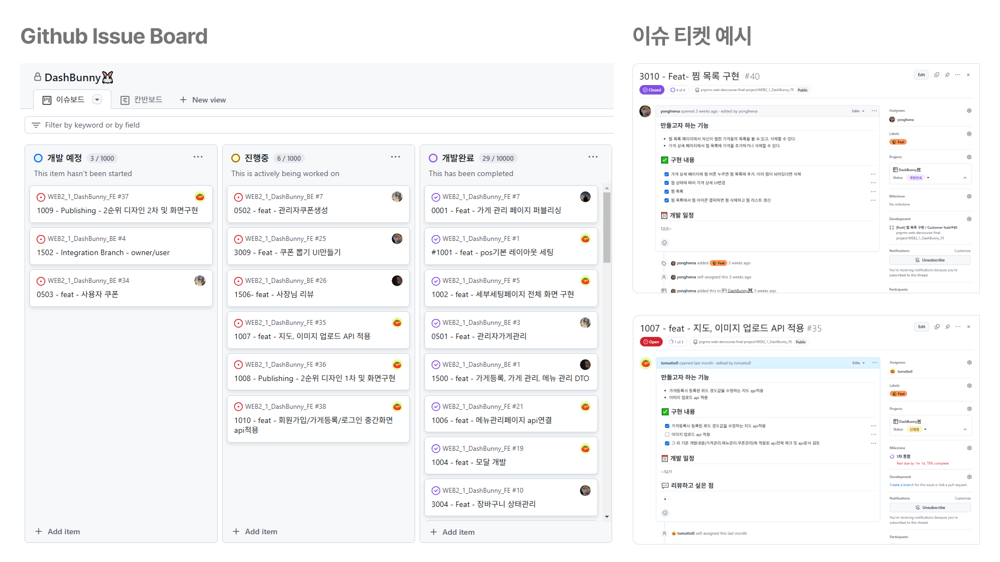

## 📌서비스 소개 및 기획의도

### 개요

**Dash Bunny**는 친근한 배달원 캐릭터 토끼를 활용해 빠르고 효율적인 딜리버리 서비스를 제공하는 프로젝트입니다.기존 배달 앱의 한계점인 메뉴 큐레이션을 **쇼츠(Shorts)콘텐츠**를 통해 제공하여 사용자 경험을 증진하는 것을 목표로 하는 배달 플랫폼 입니다.

### 벤치마킹

본 프로젝트 시스템은 배달의 민족 플랫폼을 벤치마킹하여 설계되었습니다. 다양한 배달 플랫폼의 장점들을 분석하고 통합하여, 사용자 중심의 UX/UI를 구현하는 데 초점을 맞추었습니다. 이를 통해 직관적이고 편리한 사용자 경험을 제공하고자 노력하였습니다.

## 🗓️작업 관리

일정

협업방식 - 이슈보드

